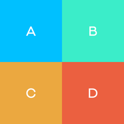
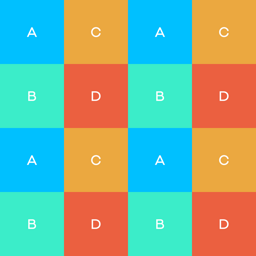

# tilestrata-underzoom
[](https://www.npmjs.org/package/tilestrata-underzoom)
[](https://travis-ci.org/naturalatlas/tilestrata-underzoom)
[](https://codecov.io/github/naturalatlas/tilestrata-underzoom)

A [TileStrata](https://github.com/naturalatlas/tilestrata) plugin for building tiles that are a mosaic of higher-zoom tiles. To use this plugin, you must have mapnik in your dependency tree.

```sh
$ npm install tilestrata-underzoom --save
```





### Sample Usage

```js
var dependency = require('tilestrata-dependency');
var underzoom = require('tilestrata-underzoom');

server.layer('mylayer').route('t.png')
	.use(underzoom({
		source: dependency('sourcelayer', 't.png'),
		size: 256,
		zooms: {
			12: 2, // underzoom z12 by 2 levels
			13: 1, // underzoom z12 by 1 level
		}
	}));

// make 2x tiles by mosaicing 1x tiles from the next zoom
server.layer('mylayer').route('t@2x.png')
	.use(underzoom({
		source: dependency('sourcelayer', 't.png'),
		inputSize: 256,
		outputSize: 512,
		zooms: 1 // underzoom all zoom levels by 1 level
	}));
```

## Contributing

Before submitting pull requests, please update the [tests](test) and make sure they all pass.

```sh
$ npm test
```

## License

Copyright &copy; 2016 [Natural Atlas, Inc.](https://github.com/naturalatlas) & [Contributors](https://github.com/naturalatlas/tilestrata-underzoom/graphs/contributors)

Licensed under the Apache License, Version 2.0 (the "License"); you may not use this file except in compliance with the License. You may obtain a copy of the License at: http://www.apache.org/licenses/LICENSE-2.0

Unless required by applicable law or agreed to in writing, software distributed under the License is distributed on an "AS IS" BASIS, WITHOUT WARRANTIES OR CONDITIONS OF ANY KIND, either express or implied. See the License for the specific language governing permissions and limitations under the License.
